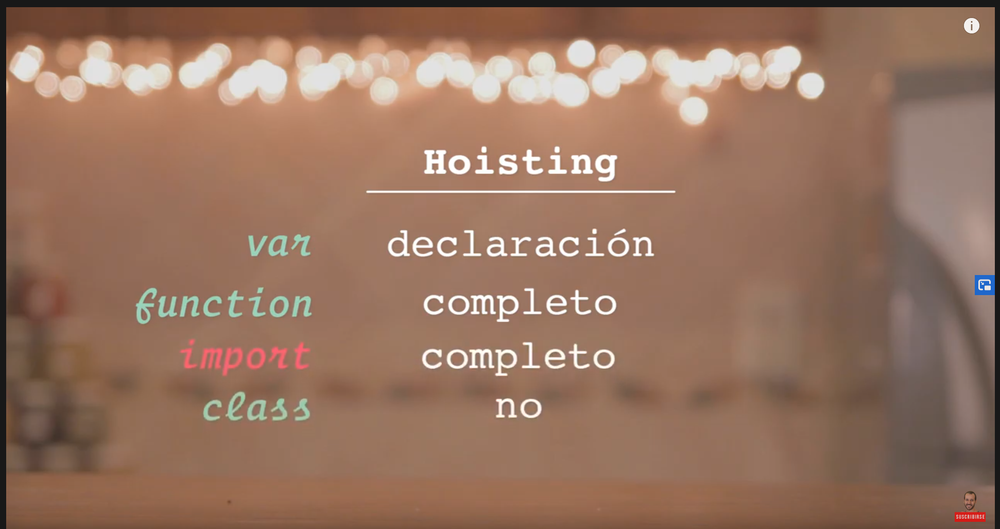

# Curso Básico de JavaScript

## 1. ¿Que es js?
    - debilmente tipado.
    -  Interpretado.

## 2. ¿Por que js?
    - JavaScript tiene una comunidad enorme de desarrolladores que te pueden ir ayudando a generar diferentes cosas.

    - Si solo estuvieras interesado en trabajar aplicaciones web tienes muchos frameworks y librerías construidas en JavaScript
     que te van a ayudar a hacer proyectos de forma mucho mas rápida, eficiente y robusta (Angular, View, React,entre otros)

    - Si no quieres trabajar solo en aplicaciones Web puedes utilizar JavaScript con un framework que se llama React Native para  
    poder construir aplicaciones nativas como Android y IOS.

    - Puedes construir aplicaciones de escritorio con JavaScript, usando un framework llamado Electron, pueden correr en Mac o Windows.

    - También puedes trabajar en la parte del Back-end o **IOT **(Internet Od Things) es un concepto que se refiere a una interconexion digital
    de objetos cotidianos con Internet. Esto con un Framework llamado NodeJS, el cual es un entorno de ejecución de JavaScript que corre 
    directamente en el Back-end.

## 3. Elementos de un Lenguaje de Programación: Variables, Funciones y Sintaxis  
#### Tipos de datos en js
  
#### Primitivos: 
- number
- string
- boolean
- null
- undefined

#### Objetos: 
- array 
- objetos: {}

## 4. Variables
var, const, let

## 5. Funciones
Hay dos tipos:
   * declarativas  
   `function myFunction() {}`
   * de expresión  
   `var myFunction = function () {};`
 
## 6. Scope
  
- Global
- Local

## 7. Hoisting
  

    Las variables declaradas con let y const también sufren de hoisting,
    son elevadas a una llamada temporal dead zone (Zona muerta temporal)

    temporal dead zone (Zona muerta temporal): Una región de nuestro código donde una variable no se puede
    acceder por que la ejecución del programa tofavía no pasó por la línea de código donde es declarada.

    El hoisting solo pasa con versiones antiguas de js como ES5 e inferiores y solo aplica para variables y funciones

## 8. Coerción
    Significa cambiar un tipo de valor a otro tipo.

hay dos tipos de coercion:  
- Inplicitas: por ejmplo la concatenación con string:  
`var a = 4 + '7' = 47` en este caso el signo + concatena  
`var a = 4 * '7' = 28` en este caso el signo * es multiplicación y js transforma el 7 a número
- Explicitas: parseo explicito de un tipo a otro tipo

## 9. valores truthy y falsy
    Que tipo valor es verdadero y que tipo de valor es falso

    //Ejemplos en los que Boolean devuelve Falso:  
    Boolean(0); //false
    Boolean(null); //false
    Boolean(NaN); //false
    Boolean(undefined); //false
    Boolean(false); //false
    Boolean(""); //false
    
    //Ejemplos en los que Boolean devuelve verdadero:
    Boolean(1); //true para 1 o cualquier número diferente de cero (0)
    Boolean("a"); //true para cualquier caracter o espacio en blanco en el string
    Boolean([]); //true aunque el array esté vacío
    Boolean({}); //true aunque el objeto esté vacío
    Boolean(function(){}); //Cualquier función es verdadera también

## 14. Arrays

    Un Array es un tipo de estructura de datos, objeto. Puede guardar datos distintos dentro, guarda los datos en forma de lista.

    .lenght devuelve la longitud del array.
    .push() agrega elementos al final de array.
    .pop() elimina el último elemento del array.
    .unshift() agrega un elemento al array, pero lo agrega en primer lugar.
    .shift() elimina el elemento que está en el inicio del array.
    .indexOf devuelve la posición de un elemento del array.

## 20. Recorriendo Arrays con .find(), .forEach() y .some()
    .some() ejecuta una validación sobre cada elemento de un array, y retorna true a false